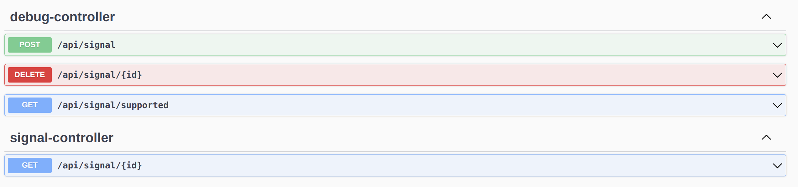

# DB MERCHANT

Thank You that you are looking at my code, below I'll try to describe setup process and how to use given app.
### How to run?

1) `git clone` project
2) Make sure that ports `8080` and `5432` are free
3) Run docker-compose by script
```bash
cd docker
./restart.sh
```

In case that your env doesn't have `maven` installed, then you can try such steps.
1) run `./restart_from_zip.sh`
I've place assembled artifact in the jar folder

### How to interact with?

Visit `http://localhost:8080` you will be automatically redirected to swagger




As you can see there are 4 endpoints

1) `GET /api/signal/{id}` - invokes handler of given signal
2) (DEBUG) `POST /api/signal` - allows create database persisted configurations
```json
{
  "id": 101,
  "task": "JIRA_0002",
  "author": "Nick",
  "description": "Some task for some sprint to do something",
  "steps": {
    "steps": [
      {
        "type": "DO_ALGO"
      },
      {
        "type": "CANCEL_TRADES"
      }
    ]
  }
}
```
3) (DEBUG) `GET /api/signal/supporte` - returns all signals service is able to handle
4) (DEBUG) `GET /api/signal/{id}` - deletes database based signal

### How does it work?

Currently, there are two main types of handlers
1) code-based to add by dev-team
2) database-based to add by analysts

Code-based configurations are added just by implementing class `AbstractCodebaseSignalHandler` 
and placing them in handlers folder, after that they will be seen by spring container during start-up.
```java
public class ExampleCodebaseSignalHandler extends AbstractCodebaseSignalHandler {

    @Override
    public void handleSignal() {
        algo.setAlgoParam(1, 2);
        algo.doAlgo();
    }

    @Override
    public int getSignalId() {
        return 0;
    }
}
```
Database-based they are added as records in the database, or can be added by mentioned endpoints above.

Other types of providers can be easily implemented, for example, from web(api) providers, Excel files.
Just by implementing `DomainSpecificSignalHandlerDispatcher`.

### Feel free to contact me in case of any problems with setup!
* [Telegram](https://t.me/AlexanderLuchko)
* Email : **alex.alex.95@mail.ru**

to stop all components run `./stop.sh`